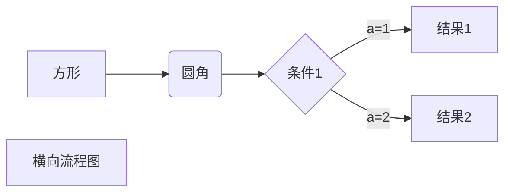

[TOC]

# 一级标题
## 二级标题
### 三级标题
#### 四级标题
##### 五级标题
###### ctrl+数字设定n级标题
*斜体*
_斜体_
**加粗**
__ctrl b__
***斜体加粗***
___ctrl i___
~~删除线~~
==高亮==
^上标^
~下标~

+ 无序列表
- 也可以用快捷键
- ctrl+shift+】（ctrl+strift+【是有序列表）
  - 二级标注
    + 三级标注
1. 有序列表
|表格|周一|周二|周……|
|-|:-|:-:|-:|
|第一行会加粗|左对齐|居中|右对齐......|
>一级引用
>>二级引用
>>>可以有n级引用
下方分割线
---
`一个框框`

```c
> 这是高级框框[^1]
[^1]:注释
将上诉文本复制到下方↓
```
> 这是高级框框[^1]
[^1]:注释

[ctrl+鼠标左键进行跳转,()用<>也可以]（https://www.bilibili.com/video/BV1hG411p7fX/?spm_id_from=333.337.search-card.all.click&vd_source=39ea2de87b63308a12bbabad318ba0fe）

`也可以直接复制黏贴`
<u>下划线</u>
‘\’+特殊符号进项转义
如\\，\*,\_,\+,\.等等


> $$E=mc^2$$
> $$
> \begin{pmatrix}
> 1 & a_1 & a_1^2 & \cdots &a_1^n \\
> 1 & a_2 & a_2^2 & \cdots &a_1^n \\
> \vdots & \vdots & \vdots & \ddots & \vdots \\
> 1 & a_m & a_m^2 & \cdots &a_m^n \\
> \end{pmatrix}
> $$


> - [ ] 待办事项
> - [x] 已办事项 

:sweat_smile::drooling_face::clown_face:

<center>居中</center>

<div style="text-align:center">
    <font style="color:red">用HTML写</font>
</div>